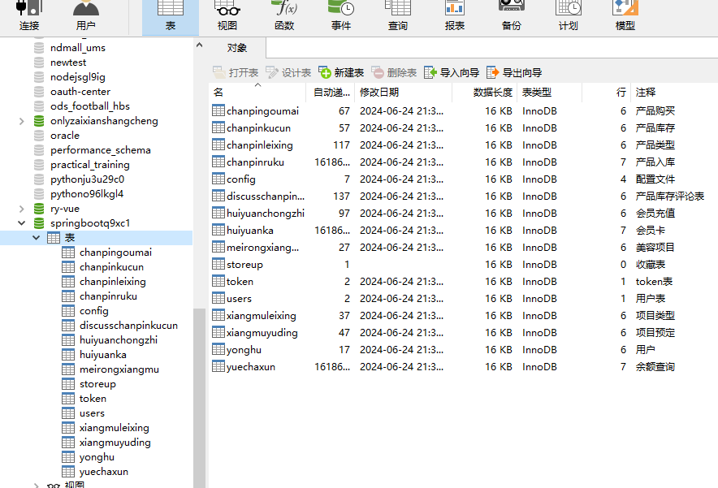
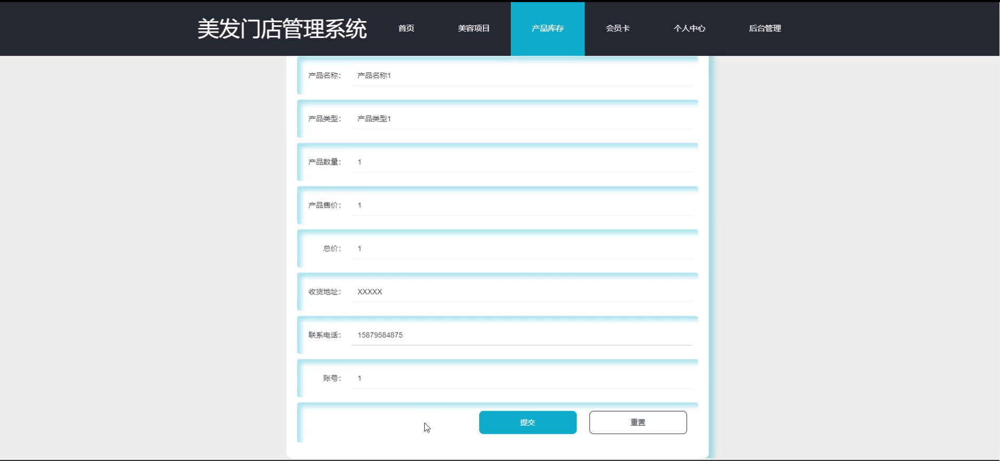

# 基于springboot的美发门店管理系统

---
### 👉作者QQ ：1556708905 微信：zheng0123Long (支持定制修改、部署调试、定制毕设)

### 👉接网站建设、小程序、H5、APP、各种系统等

---

#### 介绍

本美发门店管理系统是基于Spring Boot框架开发的一款综合性管理软件，旨在为美发门店提供一套高效、便捷的管理工具。该系统通过现代化的信息管理手段，实现了门店日常运营的数字化、智能化，从而提高了工作效率，降低了管理成本，并优化了客户体验。系统支持管理员角色和用户角色两种不同权限的登录，以满足门店不同角色的管理需求。

#### 技术栈

后端技术栈：Springboot+Mysql+Maven

前端技术栈：Vue+Html+Css+Javascript+ElementUI

开发工具：Idea+Vscode+Navicate

#### 系统功能介绍

1. 管理员角色功能模块

管理员角色拥有全面的管理权限，可以执行以下操作：  
个人中心：管理个人信息、修改密码等。  
用户管理：查看、编辑、添加、删除门店用户信息，并分配用户权限。  
美容项目管理：添加、修改、删除美容项目信息，包括项目名称、价格、时长等。  
项目类型管理：根据业务需要，灵活管理美容项目的分类。  
项目预定管理：查看、处理用户的项目预定请求，确保服务的及时性和准确性。  
产品库存管理：实时跟踪产品库存情况，进行库存预警和补货操作。  
产品购买管理：记录产品的购买信息，包括供应商、购买时间、数量等，确保供应链的顺畅。  
产品入库管理：管理产品的入库信息，确保库存数据的准确性。  
会员卡管理：创建、修改、删除会员卡类型，设置优惠政策和有效期，提升客户忠诚度。  
会员充值管理：处理会员的充值请求，记录充值金额和充值时间。  
余额查询管理：查看会员的账户余额和消费记录，为会员提供透明的消费信息。  
产品类型管理：根据门店销售情况，管理产品类型，方便分类管理和销售。  
系统管理：进行系统设置，包括数据备份、恢复、日志查看等，确保系统的稳定性和安全性。  

2. 用户角色功能模块

用户角色主要关注个人服务和消费体验，可以执行以下操作：

美容项目：查看门店提供的美容项目信息，包括项目介绍、价格、时长等，方便选择适合自己的服务。  
产品库存：查看门店产品的库存情况，了解产品的供应状态，以便及时购买。  
会员卡：购买、激活、管理个人会员卡，享受会员专属优惠和服务。  
个人中心：查看个人信息、修改密码、管理个人订单等，保障个人隐私和信息安全。  
项目预定管理：进行美容项目的在线预定，选择合适的项目和时间，避免到店等待。  
产品购买管理：购买门店产品，记录购买历史和订单状态，享受便捷的购物体验。  
会员充值管理：对个人会员卡进行充值，享受更多优惠和服务。  
余额查询管理：查看个人账户余额和消费记录，掌握个人消费情况。   

#### 系统作用

美发门店管理系统的作用主要体现在以下几个方面：  

提高工作效率：通过系统化管理，门店可以快速处理用户信息、项目预定、产品购买等事务，减少人工操作的时间和错误率，提高工作效率。  
优化顾客体验：顾客可以通过系统轻松查看项目信息、购买产品、预定项目等，享受更加便捷的服务。同时，系统提供了会员卡、会员充值等功能，提升了顾客的忠诚度和满意度。  
实时数据分析：系统可以实时跟踪门店的运营数据，如顾客数量、消费金额、项目热度等，为门店提供有力的数据支持，帮助门店做出更明智的决策。  
降低管理成本：通过自动化和集中化的管理，减少了人力和物力的投入，降低了门店的管理成本。  
提升品牌形象：一个高效、便捷的管理系统可以提升门店的专业形象和服务水平，增强顾客对门店的信任和好感度。  

#### 系统功能截图

代码结构

数据库表

登录

首页

产品库存

会员卡

用户端后台管理

项目预定管理

产品购买管理

管理端用户管理

余额查询

系统管理

#### 总结

美发门店管理系统是一款功能全面、操作便捷的管理软件，为美发门店提供了全方位的管理支持。通过该系统的使用，门店可以实现信息的数字化管理，提高工作效率，优化顾客体验，降低管理成本，提升品牌形象。同时，系统还可以为门店提供实时的数据分析支持，帮助门店做出更明智的决策，实现可持续的发展。

#### 使用说明

创建数据库，执行数据库脚本 修改jdbc数据库连接参数 下载安装maven依赖jar 启动idea中的springboot项目

后台地址：http://localhost:8080/springbootq9xc1/admin/dist/index.html

管理员  abo 密码 abo

前台地址：http://localhost:8080/springbootq9xc1/front/index.html

